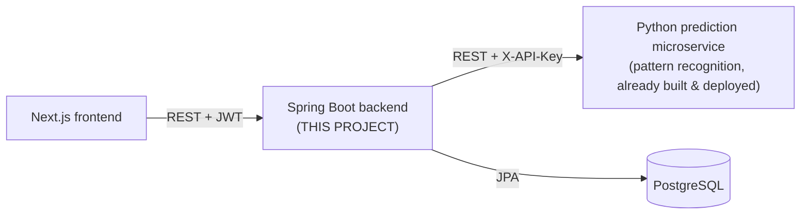

# Spring Boot Backend — Build Specification

> **Read this first (instructions to the implementing agent).**
> This document is the **authoritative specification** for the Spring Boot backend
> of a stock-trend trading app. Build the backend **fresh (greenfield)** as a new
> Maven Spring Boot project that matches this spec exactly. Where existing code in
> this repository conflicts with the spec, **replace it**; keep only what already
> matches. Do not invent features beyond this spec, and do not skip the
> **Predictor Contract** section — it describes an external service you must
> integrate with and cannot change. When done, verify every item in
> **§12 Acceptance Criteria**.

---

## 1. System context

The product is a three-service trading app. **This spec is only for the Spring
Boot backend.** The other two services already exist and are fixed.



- **Frontend (Next.js):** calls this backend's REST API. Sends a JWT in
  `Authorization: Bearer <token>` for logged-in actions.
- **This backend (Spring Boot):** owns users, auth, watchlists, prediction
  history, and price alerts; orchestrates prediction by calling the Python
  service; persists to PostgreSQL.
- **Python prediction microservice:** a pre-built, deployed 1D-CNN
  pattern-recognition service. The backend is its only client. **See §3 for its
  exact contract — treat it as a fixed external dependency.**

### Product rules (who needs an account)

- **Anonymous users (no account):** browse the stock list, request a prediction
  for any ticker, and view price history. These endpoints are **public**.
- **Registered users (JWT required):** manage a **watchlist**, view their
  **saved prediction history**, and manage **price alerts**.
- When an authenticated user requests a prediction, the backend **logs it** to
  that user's prediction history. Anonymous predictions are **not** logged.

---

## 2. Tech stack (fixed)

| Concern | Choice |
| --- | --- |
| Language / JDK | Java 17 |
| Framework | Spring Boot 3.3.x |
| Build | **Maven** (`pom.xml`) |
| Persistence | Spring Data JPA + Hibernate |
| Database | PostgreSQL |
| Security | Spring Security + JWT (stateless) |
| Password hashing | BCrypt |
| HTTP client (to predictor) | Spring `RestClient` (Spring Framework 6.1+, built in) |
| Validation | `spring-boot-starter-validation` (Jakarta Bean Validation) |
| JWT library | `io.jsonwebtoken:jjwt` (jjwt-api / jjwt-impl / jjwt-jackson), 0.12.x |
| Lombok | Recommended (reduces entity boilerplate). Optional. |
| Base package | `com.tradingapp` |

### Maven dependencies (reference)

```xml
<dependencies>
  <dependency><groupId>org.springframework.boot</groupId><artifactId>spring-boot-starter-web</artifactId></dependency>
  <dependency><groupId>org.springframework.boot</groupId><artifactId>spring-boot-starter-data-jpa</artifactId></dependency>
  <dependency><groupId>org.springframework.boot</groupId><artifactId>spring-boot-starter-security</artifactId></dependency>
  <dependency><groupId>org.springframework.boot</groupId><artifactId>spring-boot-starter-validation</artifactId></dependency>
  <dependency><groupId>org.postgresql</groupId><artifactId>postgresql</artifactId><scope>runtime</scope></dependency>

  <dependency><groupId>io.jsonwebtoken</groupId><artifactId>jjwt-api</artifactId><version>0.12.6</version></dependency>
  <dependency><groupId>io.jsonwebtoken</groupId><artifactId>jjwt-impl</artifactId><version>0.12.6</version><scope>runtime</scope></dependency>
  <dependency><groupId>io.jsonwebtoken</groupId><artifactId>jjwt-jackson</artifactId><version>0.12.6</version><scope>runtime</scope></dependency>

  <!-- test -->
  <dependency><groupId>org.springframework.boot</groupId><artifactId>spring-boot-starter-test</artifactId><scope>test</scope></dependency>
  <dependency><groupId>org.springframework.security</groupId><artifactId>spring-security-test</artifactId><scope>test</scope></dependency>
  <dependency><groupId>com.h2database</groupId><artifactId>h2</artifactId><scope>test</scope></dependency>
</dependencies>
```

---

## 3. The Predictor Contract (EXTERNAL — do not change)

The backend calls the Python prediction microservice over HTTP. **These
endpoints, headers, and JSON shapes are fixed** and defined by the already-built
service. Configure it via env vars:

- `PREDICTOR_URL` — base URL, e.g. `https://trend-predictor.onrender.com`
- `PREDICTOR_API_KEY` — sent on **every** call as header `X-API-Key: <key>`

> **Cold-start note:** the predictor may be hosted on a free tier that sleeps
> when idle. The first call after idle can take **30–60 seconds**. Use a read
> timeout of **at least 60s** and, ideally, one retry.

### 3.1 `GET /health`
```json
{ "status": "ok", "model_loaded": true, "window": 40, "horizon_days": 5 }
```
`window` = number of OHLCV bars the model needs (currently **40**).

### 3.2 `GET /history/{ticker}?limit={n}`
Returns adjusted OHLCV, oldest→newest.
```json
{
  "ticker": "AAPL",
  "rows": 60,
  "ohlcv": [
    { "date": "2026-05-01", "open": 210.1, "high": 212.4, "low": 209.7, "close": 211.8, "volume": 51200000.0 }
  ]
}
```
`404` if the ticker has no data.

### 3.3 `POST /predict`
**Request** — provide `ohlcv` (preferred, stateless) with **≥ 40 bars** in
chronological order (oldest first). `ticker` is echoed back and optional.
```json
{
  "request_id": "uuid-string",
  "ticker": "AAPL",
  "ohlcv": [
    { "open": 210.1, "high": 212.4, "low": 209.7, "close": 211.8, "volume": 51200000.0 }
  ]
}
```
> Each `ohlcv` bar has **only** `open, high, low, close, volume` (no `date`).
> When building this from `/history`, drop the `date` field and keep order.

**Success response**
```json
{
  "request_id": "uuid-string",
  "ticker": "AAPL",
  "status": "success",
  "horizon_days": 5,
  "trend_classification": "BULLISH",
  "confidence_score": 0.53,
  "detected_patterns": ["bullish_engulfing"],
  "timestamp": "2026-07-24T13:13:21Z",
  "detail": null
}
```

| Field | Meaning |
| --- | --- |
| `status` | `"success"` or `"error"`. |
| `trend_classification` | `BULLISH`, `BEARISH`, or `UNKNOWN` (on error). |
| `confidence_score` | Model probability of the predicted class, `0.5–1.0`. **Uncalibrated** — pass through as-is; never present it as a real-world probability. |
| `detected_patterns` | Candlestick patterns on the latest bar (may be empty). |
| `horizon_days` | Prediction horizon (currently 5). |
| `detail` | `null` on success; a reason string on error. |

**Error semantics**

| Predictor returns | Meaning | Backend should |
| --- | --- | --- |
| `200` + `status:"error"` + `detail` | Bad input (e.g. `insufficient history: need at least 40 bars, got N`) | Return `422` to the frontend with the `detail` message. |
| `401` | Wrong/missing `X-API-Key` | This is a backend misconfiguration → log + return `502`. |
| `503` | Model not loaded | Return `503` "prediction service unavailable". |
| timeout / connection error | Predictor down or cold-starting | Retry once; if still failing return `503`. |

### 3.4 Backend prediction flow (implement exactly)
1. `GET {PREDICTOR_URL}/history/{ticker}?limit=60` (fetch a comfortable margin ≥ 40).
2. If `rows < 40` → return `422` "not enough history to predict".
3. Map bars → `ohlcv` list (`open,high,low,close,volume`), preserve order.
4. `POST {PREDICTOR_URL}/predict` with `{ request_id: UUID, ticker, ohlcv }`.
5. If `status != "success"` → map per the error table.
6. If the caller is **authenticated**, persist a `PredictionLog` row.
7. Return a `PredictionResult` DTO (see §7) to the frontend.

---

## 4. Project structure

```
trading-backend/
├── pom.xml
├── Dockerfile
├── src/main/java/com/tradingapp/
│   ├── TradingBackendApplication.java
│   ├── config/
│   │   ├── SecurityConfig.java          # filter chain, CORS, password encoder
│   │   ├── RestClientConfig.java        # predictor RestClient bean
│   │   └── SchedulingConfig.java        # @EnableScheduling (alerts)
│   ├── security/
│   │   ├── JwtService.java              # generate/validate JWT
│   │   ├── JwtAuthenticationFilter.java # OncePerRequestFilter
│   │   └── CustomUserDetailsService.java
│   ├── user/
│   │   ├── User.java  Role.java  UserRepository.java
│   ├── auth/
│   │   ├── AuthController.java  AuthService.java
│   │   └── dto/ RegisterRequest LoginRequest AuthResponse UserResponse
│   ├── stock/
│   │   ├── StockController.java  StockCatalog.java   # public stock list
│   ├── prediction/
│   │   ├── PredictorClient.java          # HTTP calls to Python service
│   │   ├── PredictionController.java  PredictionService.java
│   │   ├── PredictionLog.java  PredictionLogRepository.java
│   │   └── dto/ OhlcvBar PredictRequest PredictResponse HistoryResponse PredictionResult
│   ├── watchlist/
│   │   ├── WatchlistItem.java  WatchlistRepository.java
│   │   ├── WatchlistController.java  WatchlistService.java
│   │   └── dto/ WatchlistRequest WatchlistResponse
│   ├── alert/
│   │   ├── Alert.java  AlertDirection.java  AlertRepository.java
│   │   ├── AlertController.java  AlertService.java  AlertChecker.java  # @Scheduled
│   │   └── dto/ AlertRequest AlertResponse
│   └── common/
│       ├── GlobalExceptionHandler.java  ApiError.java
│       └── ApiException.java (+ NotFoundException, BadRequestException, UpstreamException)
└── src/main/resources/
    └── application.yml
```

---

## 5. Data model (JPA entities)

Use `ddl-auto: update` for dev. All ids `Long` `@GeneratedValue(IDENTITY)`.
Timestamps `Instant`, defaulted on persist.

### User
| Field | Type | Notes |
| --- | --- | --- |
| id | Long | PK |
| email | String | **unique**, not null, validated email |
| username | String | not null |
| passwordHash | String | not null (BCrypt) |
| role | Role enum | `USER` / `ADMIN`, default `USER` |
| createdAt | Instant | set on persist |

### WatchlistItem
| Field | Type | Notes |
| --- | --- | --- |
| id | Long | PK |
| user | User | `@ManyToOne`, not null |
| ticker | String | not null, stored uppercase |
| createdAt | Instant | |
Unique constraint on **(user_id, ticker)** — a user can't add the same ticker twice.

### PredictionLog
| Field | Type | Notes |
| --- | --- | --- |
| id | Long | PK |
| user | User | `@ManyToOne`, not null |
| ticker | String | |
| trendClassification | String | `BULLISH`/`BEARISH` |
| confidenceScore | double | |
| horizonDays | int | |
| detectedPatterns | String | comma-joined, or `@ElementCollection` |
| createdAt | Instant | |

### Alert
| Field | Type | Notes |
| --- | --- | --- |
| id | Long | PK |
| user | User | `@ManyToOne`, not null |
| ticker | String | not null, uppercase |
| targetPrice | BigDecimal | not null |
| direction | AlertDirection enum | `ABOVE` / `BELOW` |
| triggered | boolean | default false |
| createdAt | Instant | |
| triggeredAt | Instant | nullable |

---

## 6. API endpoints

Base path: `/api`. All responses JSON. All list/`me` mutations require JWT.

### Public (no auth)
| Method | Path | Body | Returns |
| --- | --- | --- | --- |
| POST | `/api/auth/register` | `RegisterRequest` | `201` + `AuthResponse` (auto-login) |
| POST | `/api/auth/login` | `LoginRequest` | `200` + `AuthResponse` |
| GET | `/api/stocks` | — | `200` list of `{ticker, name}` (curated catalog) |
| GET | `/api/stocks/{ticker}/history?limit=` | — | `200` proxied history (see §3.2) |
| GET | `/api/predict/{ticker}` | — | `200` `PredictionResult`. **If a valid JWT is present, also log to the user's history.** |

### Authenticated (JWT required)
| Method | Path | Body | Returns |
| --- | --- | --- | --- |
| GET | `/api/me` | — | current `UserResponse` |
| GET | `/api/watchlist` | — | list of `WatchlistResponse` |
| POST | `/api/watchlist` | `{ "ticker": "AAPL" }` | `201` created item (409 if duplicate) |
| DELETE | `/api/watchlist/{ticker}` | — | `204` |
| GET | `/api/predictions/history` | — | user's `PredictionLog` list, newest first |
| GET | `/api/alerts` | — | list of `AlertResponse` |
| POST | `/api/alerts` | `AlertRequest` | `201` created alert |
| DELETE | `/api/alerts/{id}` | — | `204` (only the owner's) |

> `/api/predict/{ticker}` is public but **optionally authenticated**: the JWT
> filter must populate the security context when a token is present, and the
> controller logs a `PredictionLog` only when the principal is a real user.

---

## 7. DTOs (records)

```java
// auth
record RegisterRequest(@NotBlank String username, @Email String email, @Size(min=8) String password) {}
record LoginRequest(@Email String email, @NotBlank String password) {}
record AuthResponse(String token, String tokenType, long expiresInMs, UserResponse user) {} // tokenType="Bearer"
record UserResponse(Long id, String username, String email, String role) {}

// prediction (frontend-facing)
record PredictionResult(String ticker, String trend, double confidence,
                        int horizonDays, List<String> detectedPatterns, Instant timestamp) {}

// predictor client (mirror §3 EXACTLY — snake_case JSON)
record OhlcvBar(double open, double high, double low, double close, double volume) {}
record PredictRequest(String request_id, String ticker, List<OhlcvBar> ohlcv) {}
record PredictResponse(String request_id, String ticker, String status, int horizon_days,
                       String trend_classification, double confidence_score,
                       List<String> detected_patterns, String timestamp, String detail) {}
record HistoryBar(String date, double open, double high, double low, double close, double volume) {}
record HistoryResponse(String ticker, int rows, List<HistoryBar> ohlcv) {}

// watchlist / alerts
record WatchlistRequest(@NotBlank String ticker) {}
record WatchlistResponse(Long id, String ticker, Instant createdAt) {}
record AlertRequest(@NotBlank String ticker, @NotNull BigDecimal targetPrice, @NotNull AlertDirection direction) {}
record AlertResponse(Long id, String ticker, BigDecimal targetPrice, String direction, boolean triggered, Instant createdAt, Instant triggeredAt) {}
```

> The predictor DTOs use `snake_case` field names because that is the exact JSON
> the Python service emits/accepts. Keep them snake_case (or add `@JsonProperty`).
> All other DTOs use normal camelCase.

---

## 8. Security

- **Stateless** JWT. `SessionCreationPolicy.STATELESS`, CSRF disabled.
- **Password hashing:** `BCryptPasswordEncoder`.
- **JWT:** HS256 signed with `JWT_SECRET`; subject = user email; claims include
  `role`; expiry = `JWT_EXPIRATION_MS`. Implement `JwtService.generateToken(user)`,
  `extractEmail(token)`, `isValid(token, userDetails)`.
- **Filter:** `JwtAuthenticationFilter extends OncePerRequestFilter` reads
  `Authorization: Bearer`, validates, and sets the `SecurityContext`. It must
  **not** reject requests with no token (public routes rely on that) — only set
  the context when a valid token is present.
- **Authorization rules** (in `SecurityConfig`):
  - `permitAll`: `POST /api/auth/**`, `GET /api/stocks/**`, `GET /api/predict/**`,
    `GET /actuator/health`, and any OpenAPI/Swagger paths.
  - `authenticated`: everything else (`/api/me`, `/api/watchlist/**`,
    `/api/predictions/**`, `/api/alerts/**`).
- **CORS:** allow the frontend origin from env `CORS_ALLOWED_ORIGINS`
  (comma-separated), methods `GET,POST,DELETE,OPTIONS`, headers `*`, allow the
  `Authorization` header.

### Reference: SecurityFilterChain
```java
@Bean
SecurityFilterChain filterChain(HttpSecurity http, JwtAuthenticationFilter jwtFilter) throws Exception {
    http.csrf(c -> c.disable())
        .cors(Customizer.withDefaults())
        .sessionManagement(s -> s.sessionCreationPolicy(SessionCreationPolicy.STATELESS))
        .authorizeHttpRequests(a -> a
            .requestMatchers(HttpMethod.POST, "/api/auth/**").permitAll()
            .requestMatchers(HttpMethod.GET, "/api/stocks/**", "/api/predict/**").permitAll()
            .requestMatchers("/actuator/health").permitAll()
            .anyRequest().authenticated())
        .addFilterBefore(jwtFilter, UsernamePasswordAuthenticationFilter.class);
    return http.build();
}
```

---

## 9. Predictor integration (reference)

### RestClient bean
```java
@Bean
RestClient predictorRestClient(@Value("${predictor.base-url}") String baseUrl,
                               @Value("${predictor.api-key}") String apiKey) {
    var factory = new SimpleClientHttpRequestFactory();
    factory.setConnectTimeout(5_000);
    factory.setReadTimeout(60_000); // tolerate free-tier cold start
    return RestClient.builder()
        .baseUrl(baseUrl)
        .defaultHeader("X-API-Key", apiKey)
        .requestFactory(factory)
        .build();
}
```

### PredictorClient
```java
@Component
public class PredictorClient {
    private final RestClient client;
    public PredictorClient(RestClient predictorRestClient) { this.client = predictorRestClient; }

    public HistoryResponse getHistory(String ticker, int limit) {
        return client.get().uri("/history/{t}?limit={l}", ticker, limit)
            .retrieve().body(HistoryResponse.class);
    }
    public PredictResponse predict(PredictRequest req) {
        return client.post().uri("/predict").body(req)
            .retrieve().body(PredictResponse.class);
    }
}
```
Wrap calls in try/catch; translate connection/timeout and non-2xx into the
mapped backend responses from §3. Implement one retry for the cold-start case.

---

## 10. Configuration (`application.yml`)

Everything secret/environment-specific comes from env vars (with dev defaults).

```yaml
server:
  port: ${SERVER_PORT:8080}

spring:
  datasource:
    url: ${SPRING_DATASOURCE_URL:jdbc:postgresql://localhost:5432/trading}
    username: ${SPRING_DATASOURCE_USERNAME:postgres}
    password: ${SPRING_DATASOURCE_PASSWORD:postgres}
  jpa:
    hibernate.ddl-auto: update
    open-in-view: false

predictor:
  base-url: ${PREDICTOR_URL:http://localhost:8000}
  api-key: ${PREDICTOR_API_KEY:}

security:
  jwt:
    secret: ${JWT_SECRET:change-me-dev-secret-at-least-32-bytes-long}
    expiration-ms: ${JWT_EXPIRATION_MS:86400000}   # 24h

cors:
  allowed-origins: ${CORS_ALLOWED_ORIGINS:http://localhost:3000}
```

### Environment variables (all)
| Var | Purpose |
| --- | --- |
| `SERVER_PORT` | HTTP port (Render injects `PORT` — map it) |
| `SPRING_DATASOURCE_URL/USERNAME/PASSWORD` | PostgreSQL connection |
| `PREDICTOR_URL` | Base URL of the Python prediction service |
| `PREDICTOR_API_KEY` | `X-API-Key` for the predictor |
| `JWT_SECRET` | HS256 signing key (≥ 32 bytes) |
| `JWT_EXPIRATION_MS` | Token lifetime |
| `CORS_ALLOWED_ORIGINS` | Frontend origin(s), comma-separated |

---

## 11. Cross-cutting behaviors

- **Global error handling:** `@RestControllerAdvice` returning a consistent
  `ApiError { timestamp, status, error, message, path }`. Map:
  validation → `400`; bad credentials / no token on protected route → `401`;
  forbidden → `403`; not found → `404`; duplicate watchlist → `409`;
  predictor bad-input → `422`; predictor down → `503`; unexpected → `500`.
- **Alerts checker:** `AlertChecker` with `@Scheduled(fixedDelayString=...)`
  periodically fetches the latest close for each un-triggered alert's ticker
  (via `PredictorClient.getHistory(ticker, 1)`), and if the price crosses the
  target in the alert's direction, sets `triggered=true` + `triggeredAt`.
  (Actual email/push notification is **out of scope** — flagging is enough.)
- **Ownership:** watchlist items, prediction logs, and alerts are always scoped
  to the authenticated user; never let one user read/delete another's rows.
- **Ticker normalization:** uppercase and trim tickers before storing/forwarding.

---

## 12. Acceptance criteria (Definition of Done)

The build is complete when all of these hold:

- [ ] `mvn clean verify` passes; app boots against a local PostgreSQL.
- [ ] `POST /api/auth/register` then `POST /api/auth/login` return a working JWT.
- [ ] A protected route (`GET /api/watchlist`) returns `401` without a token and
      `200` with a valid token.
- [ ] `GET /api/predict/{ticker}` works **without** auth and returns a
      `PredictionResult`; with a valid token it **also** creates a `PredictionLog`.
- [ ] `GET /api/stocks` and `GET /api/stocks/{ticker}/history` work anonymously.
- [ ] Watchlist add/list/delete works and rejects duplicates with `409`.
- [ ] `GET /api/predictions/history` returns only the caller's predictions.
- [ ] Alerts create/list/delete works; the scheduled checker flips `triggered`.
- [ ] Predictor errors are mapped correctly (insufficient history → `422`,
      predictor down → `503`); a real prediction succeeds end-to-end against a
      running predictor (`PREDICTOR_URL` + `PREDICTOR_API_KEY` set).
- [ ] CORS allows the configured frontend origin with the `Authorization` header.
- [ ] All secrets come from env vars; nothing sensitive is hard-coded.

### Tests to include
- `JwtService` unit tests (generate → validate → extract; expiry rejection).
- `PredictionService` test with a **mocked** `PredictorClient` (Mockito):
  success path logs when authenticated; insufficient-history → `422`.
- `MockMvc` slice/integration tests for auth, watchlist ownership, and the
  public-vs-protected boundary. Use H2 for the test profile.

---

## 13. Out of scope (do NOT build)

- Portfolio / paper-trading / holdings / P&L.
- Real brokerage or order execution.
- WebSockets / real-time streaming quotes.
- Actual email/SMS/push delivery for alerts (flag `triggered` only).
- Changing the Python predictor's API (it is fixed — integrate, don't modify).

---

## 14. Deployment (reference, optional now)

- Multi-stage `Dockerfile` (Maven build → slim JRE runtime).
- Deployable to Render as a Docker web service + a Render PostgreSQL instance;
  set all env vars from §10. Map Render's injected `PORT` to `SERVER_PORT`.
- The frontend origin must be added to `CORS_ALLOWED_ORIGINS`.
```
